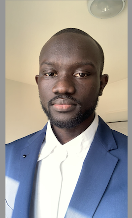

# 👋 Bonjour, je suis Seydina Mouhamet Bane

  

Je suis **Data Scientist passionné par l’Intelligence Artificielle**.  
Je conçois et développe des produits innovants tels que des **chatbots**, des **agents IA** et d’autres solutions intelligentes pour répondre à des **besoins réels** et faciliter la vie des utilisateurs.

---

## 💻 Compétences

### Langages
 
 
 

### Frameworks & Librairies
 
 
 

### Outils & Bases de données
 
 
 

---

## 📂 Projets phares

| Projet | Description | Lien |
|--------|-------------|------|
| Agent IA de Lecture PDF (FR) | Assistant intelligent pour lire et analyser des fichiers PDF en français avec extraction de texte et réponses aux questions | [Voir sur GitHub](https://github.com/SeydinaBANE/Agent_IA_pdf) |
| Résumeur de Réunion Intelligent | Outil IA pour générer automatiquement des résumés précis et structurés de réunions | [Voir sur GitHub](https://github.com/SeydinaBANE/Resumeur_Intelligent) |
| Détection de Visage avec Streamlit et OpenCV | Application utilisant Streamlit et OpenCV pour détecter et visualiser des visages en temps réel | [Voir sur GitHub](https://github.com/SeydinaBANE/Detection_Faciale_Streamlit_OpenCV) |

---

## 📊 Tous mes projets GitHub

---

## 📝 Publications et contributions

Je partage régulièrement des idées et tutoriels sur LinkedIn.  
[Découvrir mes publications](https://www.linkedin.com/in/seydina-mouhamet-bane-4710931a1)

---

## 🚀 Me suivre

- LinkedIn : [Seydina Mouhamet Bane](https://www.linkedin.com/in/seydina-mouhamet-bane-4710931a1)  
- GitHub : [SeydinaBANE](https://github.com/SeydinaBANE)
